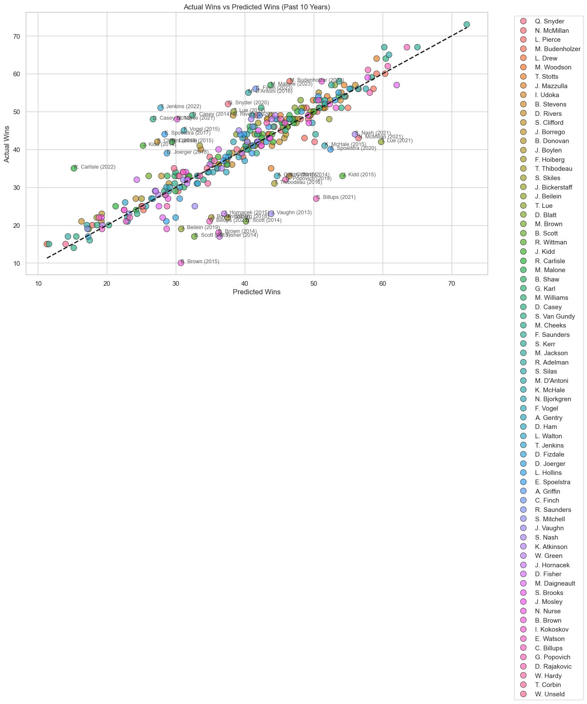
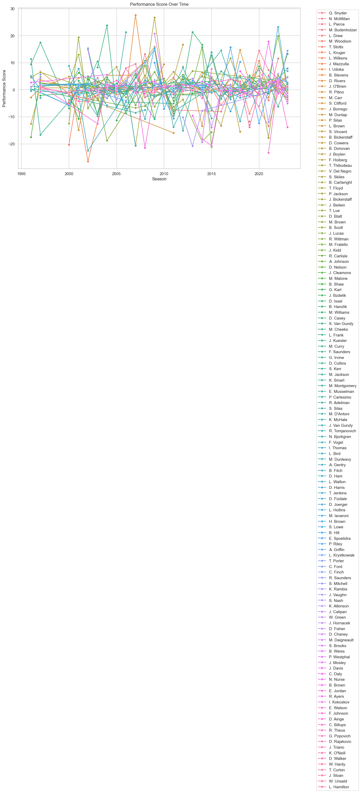

# NBA Coach Stat

## Introduction

Determining the effectiveness of an NBA coach can be incredibly challenging. The multitude of variables that influence team performance—ranging from player talent and injuries to opponent strength and even luck—makes it difficult to isolate a coach's impact. Many debates about who the best coaches are remain unresolved due to the subjective nature of existing evaluation methods. With "NBA Coach Stat," we aim to quantify coaching performance using a data-driven approach, leveraging comprehensive team statistics and advanced machine learning techniques.

## Project Overview

"NBA Coach Stat" is a comprehensive project designed to evaluate NBA coaching performance objectively. By aggregating and analyzing extensive datasets, we strive to offer insights into how much influence a coach has on their team's success. This project includes scraping detailed team statistics, calculating year-over-year performance changes, ranking teams, and employing machine learning models to predict and assess coaching efficacy.

## Motivation

The motivation behind this project stems from the complexity and often subjective nature of evaluating NBA coaches. While some metrics like win-loss records are straightforward, they don't paint the full picture. For instance, how does one account for a coach's ability to develop young talent, manage player egos, or make in-game adjustments? "NBA Coach Stat" aims to bring more clarity and objectivity to this process by leveraging data science and machine learning.

## Data Collection

To build a robust database of team statistics, we scraped data from Basketball Reference. The following Python scripts were used in this process:

1. **`get_preseason_odds.py`**: Collects preseason odds for NBA teams to set expectations for each season.
2. **`get_roster_cont.py`**: Gathers information on team rosters, including player continuity and changes.
3. **`get_Teams.py`**: Fetches basic information about NBA teams, including historical data.
4. **`per_game_yoy.py`**: Calculates year-over-year statistics for teams on a per-game basis.
5. **`rank_per_game.py`**: Ranks teams based on their per-game performance in various statistical categories.
6. **`team_basic.py`**: Accumulates basic team statistics for each season.

These scripts together create a comprehensive dataset that includes basic stats, year-over-year changes, team ranks, and more.

## Machine Learning Approach

To analyze coaching performance, we employed advanced machine learning techniques, specifically using PyTorch to build neural networks. Our approach involves several steps:

1. **Data Preparation**: We preprocess the accumulated data, ensuring it is suitable for training machine learning models. This involves handling missing values, normalizing data, and creating training and test sets.

2. **Model Development**: Using PyTorch, we developed neural network models to predict team performance based on various input features (e.g., preseason odds, roster continuity, previous season performance).

3. **Training and Evaluation**: We train the models using historical data, allowing the network to learn patterns and relationships between the features and team performance. After training, we evaluate the models on test data to ensure they generalize well to unseen data.

4. **Performance Analysis**: We compare the predicted performance to actual performance to gauge coaching effectiveness. By quantifying the discrepancy between expected and actual outcomes, we can infer the potential impact of coaching.

## Visualizations

Below are some key visualizations generated during our analysis:

### Coach Performance (Last 10 Years)



_Description: This graph shows the performance of various NBA coaches over the last 10 years, highlighting trends and changes in their effectiveness._

### Coach Performance Over Years



_Description: This graph illustrates the performance of NBA coaches over multiple years, allowing us to track their progress and impact on their respective teams._

## Code Overview

### `coach_stat.ipynb`

The Jupyter Notebook `coach_stat.ipynb` provides a comprehensive walkthrough of the data analysis and machine learning processes. It includes:

- Data Loading and Preprocessing
- Exploratory Data Analysis (EDA)
- Neural Network Model Development with PyTorch
- Model Training and Evaluation
- Performance Metrics and Visualizations

### Python Scripts

- **`get_preseason_odds.py`**: Script to scrape preseason odds.
- **`get_roster_cont.py`**: Script to gather roster continuity information.
- **`get_Teams.py`**: Script to fetch basic team data.
- **`per_game_yoy.py`**: Script to calculate year-over-year stats on a per-game basis.
- **`rank_per_game.py`**: Script to rank teams based on per-game performance.
- **`team_basic.py`**: Script to accumulate basic team statistics.

## Getting Started

### Prerequisites

- Python 3.7+
- Selenium
- BeautifulSoup4
- Pandas
- PyTorch

### Installation

1. Clone the repository:
    ```bash
    git clone https://github.com/yourusername/nba-coach-stat.git
    cd nba-coach-stat
    ```

2. Run the scripts to scrape the data:
    ```bash
    python get_preseason_odds.py
    python get_roster_cont.py
    python get_Teams.py
    python per_game_yoy.py
    python rank_per_game.py
    python team_basic.py
    ```

3. Open the Jupyter Notebook to explore the data and run the analysis:
    ```bash
    jupyter notebook coach_stat.ipynb
    ```

## Contributing

We welcome contributions to enhance the project. Please fork the repository and submit pull requests with descriptive commit messages.

## License

This project is licensed under the MIT License. See the LICENSE file for more details.
